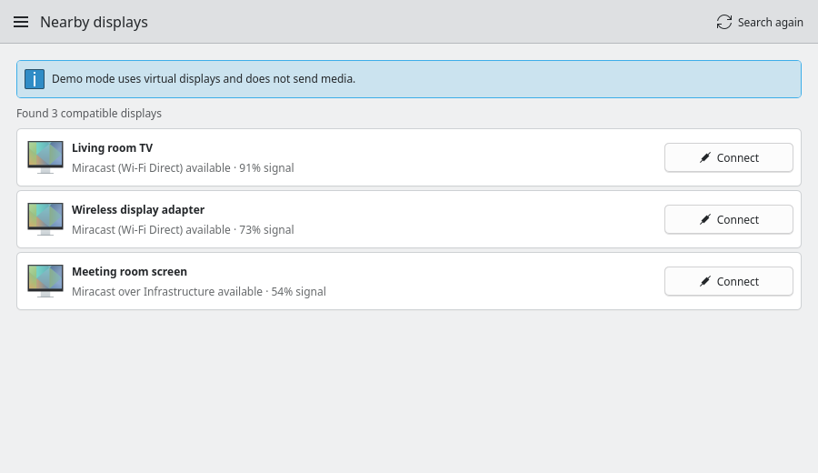

# Mirdispo

[](https://github.com/hencyber/mirdispo/actions/workflows/ci.yml)

A Miracast / Wi-Fi Display sender for KDE Plasma 6. It is a Kirigami
interface on top of the streaming engine from
[GNOME Network Displays](https://github.com/GNOME/gnome-network-displays).
It includes diagnostics and a demo mode that needs no hardware.



## Install

**Any distribution:** open **[hencyber.github.io/mirdispo](https://hencyber.github.io/mirdispo)**
and press **Install Mirdispo**. Discover, or your distribution's software
centre, opens and installs it. Mirdispo then appears in the application menu
and updates itself along with your other apps. No further setup is needed.

If the button does nothing, the same thing from a terminal:

```bash
flatpak install --user https://hencyber.github.io/mirdispo/mirdispo.flatpakref
```

**Debian, Ubuntu and derivatives:** a `.deb` is attached to every
[release](https://github.com/hencyber/mirdispo/releases/latest). Open it with
your package manager, or run `sudo apt install ./mirdispo_*_amd64.deb`. It does
not update itself; install a newer `.deb` the same way.

## Built on GNOME Network Displays

The hard part of this project is not ours. Everything that negotiates a
Wi-Fi Display session, speaks RTSP to a receiver and moves the pixels is
[GNOME Network Displays](https://github.com/GNOME/gnome-network-displays)
It is maintained by Benjamin Berg and Christian Glombek, with Anupam Kumar,
Pedro Sader Azevedo and many other contributors. They have spent years on a
protocol that is unforgiving in practice. This project redistributes that
engine without its GTK interface. It adds a Plasma front end, packaging, and
fifteen patches.

Those patches are in `packaging/patches/`, and each one is a fault found by
using the engine rather than a rewrite of it: encoder selection, stream unit
naming, shutdown ordering, PulseAudio teardown, a use-after-free in receiver
discovery, reuse of the screen sharing permission, and choosing the streamed
display mode from what both ends support. Four more let the engine run
without GTK, inside a Flatpak sandbox with the screen sharing permission kept
for the session, and under a D-Bus name of its own. The last two have each
stream report on D-Bus whether the receiver is getting a picture, and whether
the user ended it from the desktop. Two more let the engine run from wherever
it is installed and send the desktop's sound to the receiver. They are written to be readable upstream, and belong there
more than here.

Both projects are under the GNU General Public License, version 3 or later.
That is what makes building on their work possible, and it means anyone
receiving this gets the same freedoms: the full licence is in `LICENSE`, and
`packaging/copyright` records who holds copyright over what.

## What works today

- Plasma-native Qt 6 + Kirigami interface
- A system tray icon: closing the window keeps a cast going, and the tray
  shows what is being shared and stops it
- Miracast P2P, Miracast over Infrastructure, and Chromecast discovery
- The screen and the desktop's sound on the receiver: sound switches to the
  receiver when a cast starts and back when it ends
- Diagnostics that answer why casting would not work: NetworkManager, the
  casting backend, the ScreenCast portal, GStreamer elements and whether
  receivers on the network can be discovered at all
- Automatic retries when a receiver refuses a handshake or a link drops
- Demo mode that exercises discovery, connection, streaming, and disconnect
  states without Miracast hardware
- A Flatpak that runs on any distribution and updates itself, and a Debian
  package
- Unit tests for the front end and regression tests for the engine patches

A receiver that announces itself both over the network and over Wi-Fi Direct
is shown once, on the route that connects fastest. Over the network a cast
starts in about a second; Wi-Fi Direct has to negotiate a channel with the
receiver first, which takes longer and sometimes has to be retried. The
application does that retrying itself.

## Run it from source on Debian, Ubuntu and derivatives

The application uses system packages so it integrates with the installed Plasma
theme:

```bash
sudo apt install python3-pyqt6 python3-pyqt6.qtqml python3-dbus python3-gi \
  qml6-module-org-kde-kirigami qml6-module-org-kde-desktop \
  gir1.2-gstreamer-1.0 gstreamer1.0-pipewire gstreamer1.0-plugins-base \
  gstreamer1.0-plugins-good gstreamer1.0-plugins-bad gstreamer1.0-plugins-ugly
make backend
./bin/mirdispo
```

`make backend` builds the casting engine into `vendor/amd64/`, where a
checkout finds it; see [Building from source](#building-from-source) for what
it needs.

Optional system installation (use `PREFIX=$HOME/.local` for one user):

```bash
sudo make install
mirdispo
```

For normal installation, use the release `.deb` instead. It installs the app,
backend, icon, menu entry, metadata, and runtime dependencies through APT. The
downloaded `.deb` can be deleted after installation; installed files are owned
and tracked by dpkg independently of the installer file.

To explore the complete flow without a receiver:

```bash
./bin/mirdispo --demo
```

Print a machine-readable capability report:

```bash
./bin/mirdispo --diagnostics
```

## Test

```bash
make test     # Python tests, plus the engine's C tests after make backend
make smoke    # starts the interface in demo mode and closes it again
```

## Architecture

The interface and the casting engine are separate programs. `DisplayBackend`
exposes a small state machine and Qt models to QML, and talks to the engine's
daemon over D-Bus. The engine owns NetworkManager, the ScreenCast portal,
PipeWire, RTSP and GStreamer. [docs/DESIGN.md](docs/DESIGN.md) describes how
the parts fit together and why the less obvious decisions were made.

## License

GPL-3.0-or-later. The Plasma front end is new work by this project. The GNOME
Network Displays engine stays credited to its original authors. Its complete
0.99.0 source archive and the patches applied to it are in this repository and
in the Debian package, so the exact source of every binary we ship is
available. One file in the engine, the systemd D-Bus interface description it
took from Flatpak, is LGPL-2.1-or-later. `packaging/copyright` lists every
copyright holder.

## Trademarks

Miracast and Wi-Fi Display are trademarks of Wi-Fi Alliance, and Chromecast is
a trademark of Google LLC. GNOME is a trademark of the GNOME Foundation, and
KDE and Plasma are trademarks of KDE e.V. These names are used only to say
what the program works with and what it is built on.

Mirdispo has not been certified by Wi-Fi Alliance. It is not endorsed by or
affiliated with any of these organisations, including the GNOME and KDE
projects.

## Patents and codecs

Mirdispo contains no video or audio codec of its own. H.264 and AAC encoding
is done by the GStreamer plugins your distribution ships, such as
`gstreamer1.0-plugins-ugly` (x264) and `gstreamer1.0-libav`. Whether those
plugins may be used where you live is settled by your distribution and its
licensing, the same as for any other media application on the system.

## Building from source

The application itself is Python and QML and needs no build step. The
streaming backend is GNOME Network Displays with the patches in
`packaging/patches/`, and rebuilding it needs:

    meson ninja-build pkg-config gettext patch libglib2.0-dev \
    libgstreamer1.0-dev libgstreamer-plugins-base1.0-dev libgstrtspserver-1.0-dev \
    libnm-dev libportal-dev libpulse-dev libjson-glib-dev libsoup-3.0-dev \
    libprotobuf-c-dev libavahi-client-dev libavahi-gobject-dev

Then run:

    make backend

That unpacks `vendor/source/gnome-network-displays-0.99.0.tar.xz` into
`work/gnd-source`, applies every patch in `packaging/patches/` in order, builds
it with meson and ninja, and puts the stripped binaries in `vendor/amd64/`.

The Flatpak builds everything, including the engine and its patches, from
`flatpak/io.github.hencyber.Mirdispo.yml`:

    flatpak run org.flatpak.Builder --user --install --force-clean \
        work/flatpak-build flatpak/io.github.hencyber.Mirdispo.yml

`packaging/build-deb.sh` builds the package from `vendor/amd64/`, so it works
without rebuilding the backend. `make test` runs the Python tests, and adds
the backend's C regression tests when `work/gnd-build` exists.

## Publishing a release

Creating a GitHub release starts `.github/workflows/flatpak-repo.yml`. It builds
the Flatpak from `flatpak/io.github.hencyber.Mirdispo.yml`, signs it, and adds
it to the Flatpak repository on GitHub Pages, which is where installed copies
get their updates. The repository keeps the two latest versions.

Attach the `.deb` from `packaging/build-deb.sh` and the archive from
`packaging/build-flatpak-sources.sh` to each release. The archive holds the
source of every library the Flatpak bundles, which their licences require to
be offered with it.

Signing needs two repository secrets: `FLATPAK_GPG_PRIVATE_KEY`, the armoured
private key, and `FLATPAK_GPG_KEY_ID`, its fingerprint. The public half is
`flatpak/mirdispo-repo.gpg`, and the install files hand it to everyone who
installs. Keep a backup of the private key. Without it, updates can only be
published under a new key, which every installed copy would have to be
pointed at again.

## Before sharing this tree

Build output records the account name and absolute paths it was produced
under, and `tar` stamps the builder as the owner of every file it archives.
Neither belongs to the project.

    make clean     # removes build directories and caches
    make audit     # reports anything identifying that is left

`packaging/build-source.sh` writes the source archive with ownership
flattened, so archives it produces carry nothing about who built them.

Both build scripts stamp every file with the release date from the AppStream
metadata rather than the time it was written, which keeps a record of when
somebody was at the keyboard out of the archives and makes the output
reproducible. Building twice must give byte-identical files; if it does not,
something build-specific is being recorded and is worth finding.
